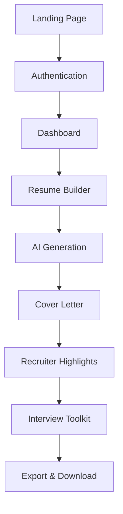

# Best Darn Resume - Product Requirements Document

## Executive Summary

**Best Darn Resume** is an AI-powered resume optimization platform that transforms job applications through intelligent content rewriting, ATS optimization, and comprehensive career toolkit generation. The platform leverages a sophisticated 7-phase AI process to create job-matched resumes with supporting materials, designed to help job seekers land 3x more interviews.

**Website**: https://bestdarnresume.site/  
**Status**: Production Ready  
**Version**: 2.0  
**Last Updated**: January 2025

---

## Vision & Mission

### Vision
To become the #1 AI-powered career advancement platform that helps ambitious professionals land their dream jobs through scientifically-optimized career materials.

### Mission
Democratize access to professional-grade resume optimization and career coaching through AI, making high-quality job application materials available to everyone regardless of background or resources.

---

## Market Analysis & User Personas

### Primary Market
- **Size**: 150M+ job seekers globally
- **Growth**: 8% YoY (remote work expansion)
- **Pain Points**: ATS rejection rates >75%, time-intensive customization, lack of industry expertise

### User Personas

#### 1. Career Switchers (Primary)
- **Demographics**: 28-45 years old, college-educated
- **Pain Points**: Industry transition, skill translation, resume gaps
- **Goals**: Position skills for new industry, highlight transferable experience
- **Willingness to Pay**: High ($20-50/month)

#### 2. Recent Graduates (Secondary)
- **Demographics**: 22-26 years old, entry-level
- **Pain Points**: Limited experience, competitive market, formatting
- **Goals**: Professional presentation, skill highlighting, interview prep
- **Willingness to Pay**: Medium ($10-25/month)

#### 3. Experienced Professionals (Primary)
- **Demographics**: 30-55 years old, senior roles
- **Pain Points**: Executive positioning, achievement quantification, ATS compliance
- **Goals**: Leadership presence, results demonstration, strategic positioning
- **Willingness to Pay**: Very High ($25-100/month)

---

## Product Architecture

### Core Application Flow


### Technical Stack

#### Frontend
- **Framework**: React 18 with TypeScript
- **Build Tool**: Vite with SWC
- **UI Library**: shadcn/ui + Radix UI primitives
- **Styling**: Tailwind CSS with custom design tokens
- **State Management**: Zustand with persistence
- **Testing**: Vitest + Testing Library + Playwright

#### Backend
- **Platform**: Supabase (PostgreSQL + Edge Functions)
- **Authentication**: Supabase Auth with RLS
- **AI Processing**: OpenAI GPT-4 via Edge Functions
- **Payments**: Stripe (Checkout + Customer Portal)
- **File Storage**: Supabase Storage

#### Infrastructure
- **Hosting**: Netlify (Frontend) + Supabase (Backend)
- **Domain**: bestdarnresume.site
- **CDN**: Built-in with Netlify
- **Monitoring**: Built-in error boundaries + logging

---

## Feature Specifications

### 1. AI-Powered Resume Generation (7-Phase System)

#### Phase 1-3: Content Analysis
- **Core Competency Extraction**: Parses job descriptions to identify key skills and requirements
- **Company Signal Analysis**: Analyzes company culture, values, and positioning from job posting
- **Resume Rewriting & Optimization**: Rewrites content with targeted keywords and ATS-friendly formatting

#### Phase 4-6: Quality & Output
- **Rapid Review Loop**: 1-5 scoring system for optimization quality
- **Final Output Generation**: Multiple format options (Markdown, Plain Text, JSON)
- **Deliverables Creation**: Generates cover letter, highlights, and interview toolkit

#### Phase 7: Enhancement
- **Grammar & Readability Check**: Flesch-Kincaid scoring and grammar validation
- **Quality Assurance**: Final optimization score and keyword matching analysis

### 2. User Authentication & Management
- **Sign-up/Sign-in**: Email/password with Supabase Auth
- **Social Auth**: Google OAuth integration
- **Password Reset**: Secure token-based reset flow
- **Session Management**: Persistent sessions with automatic refresh
- **Profile Management**: User preferences and settings

### 3. Dashboard & Resume Management
- **Resume Library**: View, organize, and manage multiple resumes
- **Quick Actions**: One-click access to builder, export, and sharing
- **Activity Feed**: Recent generation history and progress tracking
- **Master Resume Card**: Central resume management hub
- **Export Bar**: Quick access to download options (Pro feature)

### 4. Subscription & Billing
- **Stripe Integration**: Secure payment processing
- **Subscription Tiers**: Free trial + Pro subscription
- **Customer Portal**: Self-service billing management
- **Feature Gating**: Automatic enforcement of tier limitations
- **Trial Management**: 7-day free trial with usage tracking

### 5. Export & Download
- **Multiple Formats**: PDF, Word Document, JSON
- **ATS-Optimized**: Formats guaranteed to pass applicant tracking systems
- **Print Preview**: WYSIWYG preview before download
- **Version History**: Track and compare resume iterations (Pro)

### 6. Progressive Web App Features
- **Offline Support**: Continue working without internet connection
- **Auto-save**: Automatic draft saving every 30 seconds
- **Mobile Responsive**: Full functionality on mobile devices
- **Fast Loading**: Optimized bundle size and lazy loading

---

## Subscription Model

### Free Trial (7 Days)
- **Resumes**: Up to 3 resumes
- **AI Generation**: Full 7-phase system access
- **Basic Export**: Text format only
- **Support**: Community support

### Pro Subscription ($20/month)
- **Unlimited Resumes**: No limits on resume creation
- **Version History**: Track and compare iterations
- **Premium Exports**: PDF, Word, and JSON formats
- **Interview Toolkit**: Comprehensive interview preparation
- **Priority Support**: Email support with 24h response
- **Customer Portal**: Self-service billing management

### Future Tiers (Roadmap)
- **Pro+ ($35/month)**: LinkedIn optimization, salary negotiation
- **Team ($100/month)**: Multi-user accounts, collaboration features
- **Enterprise (Custom)**: White-label, API access, custom integrations

---

## User Experience Design

### Design Principles
1. **Simplicity**: Clean, uncluttered interface focusing on core actions
2. **Accessibility**: WCAG 2.1 AA compliance with keyboard navigation
3. **Speed**: Sub-2-second page loads and instant feedback
4. **Mobile-First**: Responsive design optimized for mobile usage
5. **Trust**: Professional aesthetic building confidence in AI recommendations

### Design System

#### Color Palette
```css
/* Primary Brand Colors */
--primary: #001f3f;      /* Navy Blue - Trust, Professional */
--accent: #FF851B;       /* Orange - Energy, Action */
--muted: #6B7280;        /* Gray - Supporting text */
--background: #FFFFFF;   /* White - Clean, Modern */
--foreground: #111827;   /* Near Black - High contrast */

/* Semantic Colors */
--success: #10B981;      /* Green - Completion, Success */
--warning: #F59E0B;      /* Amber - Caution, Trial ending */
--destructive: #EF4444;  /* Red - Errors, Critical actions */
```

#### Typography Scale
- **Headings**: Inter font family, semi-bold weights
- **Body**: Inter font family, regular and medium weights  
- **Scale**: 12px, 14px, 16px, 18px, 20px, 24px, 28px, 32px, 48px, 64px

#### Component Variants
- **Buttons**: Primary, Secondary, Ghost, Destructive with hover states
- **Cards**: Elevated, Interactive (with hover transforms)
- **Input Fields**: Focus rings, validation states, accessibility labels
- **Loading States**: Skeleton loaders, progress indicators

---

## Technical Architecture

### State Management Architecture
```typescript
// Core Stores
appData.ts          // Resume content, company signals, generation settings
subscriptionStore.ts // Stripe integration, feature gating, trial management  
authStore.ts        // User authentication state and session management
persistenceStore.ts // Data synchronization, offline support
dashboardStore.ts   // UI state, filters, sorting preferences
```

### Component Architecture
```
src/
├── components/
│   ├── auth/              # Authentication components
│   ├── dashboard/         # Dashboard-specific components
│   ├── builder/           # Resume builder components
│   ├── subscription/      # Billing and feature gating
│   ├── common/           # Shared components (ErrorBoundary, etc.)
│   └── ui/               # Design system components (shadcn/ui)
├── pages/                # Route-level components
├── hooks/                # Custom React hooks
├── lib/                  # Utility functions and services
├── stores/               # State management
└── integrations/         # Third-party integrations
```

### API Integration
- **Resume Generation**: `/functions/generate-resume` (OpenAI integration)
- **Subscription Management**: `/functions/create-checkout`, `/functions/customer-portal`
- **Subscription Validation**: `/functions/check-subscription`
- **Webhook Handling**: `/functions/stripe-webhook` (payment events)

### Database Schema
```sql
-- User profiles with subscription information
profiles (
  id uuid PRIMARY KEY,
  user_id uuid REFERENCES auth.users,
  email text,
  stripe_customer_id text,
  subscribed boolean DEFAULT false,
  subscription_tier text,
  subscription_end timestamptz,
  trial_start timestamptz,
  created_at timestamptz DEFAULT now()
);

-- Resume storage and management
resumes (
  id uuid PRIMARY KEY,
  profile_id uuid REFERENCES profiles(id),
  title text NOT NULL,
  is_master boolean DEFAULT false,
  created_at timestamptz DEFAULT now(),
  updated_at timestamptz DEFAULT now()
);

-- Version history for Pro users
resume_versions (
  id uuid PRIMARY KEY,
  resume_id uuid REFERENCES resumes(id),
  inputs jsonb NOT NULL,      -- Original content + job description
  outputs jsonb NOT NULL,     -- AI-generated content
  settings jsonb NOT NULL,    -- Generation preferences
  metadata jsonb,             -- Optimization scores, keywords
  created_at timestamptz DEFAULT now()
);
```

---

## Performance & Quality Standards

### Performance Targets
- **Page Load**: <2 seconds (desktop), <3 seconds (mobile)
- **AI Generation**: <30 seconds for complete 7-phase process
- **Bundle Size**: JavaScript <1.5MB, CSS <100KB
- **Lighthouse Score**: >90 Performance, >95 Accessibility, >90 SEO

### Quality Assurance
- **Test Coverage**: >80% unit test coverage
- **E2E Testing**: Playwright tests for critical user journeys
- **TypeScript**: Strict mode enabled, no `any` types in production code
- **Code Quality**: ESLint + Prettier, automated formatting
- **Browser Support**: Chrome 90+, Firefox 88+, Safari 14+, Edge 90+

### Error Handling
- **Graceful Degradation**: App continues to function with API failures
- **Error Boundaries**: Component-level error isolation
- **User Feedback**: Clear error messages with actionable solutions
- **Retry Logic**: Automatic retry with exponential backoff
- **Offline Support**: Cache critical functionality for offline use

---

## Security & Compliance

### Data Protection
- **Encryption**: TLS 1.3 for data in transit, AES-256 for data at rest
- **Authentication**: Supabase Auth with secure token management
- **Authorization**: Row-level security (RLS) for all database operations
- **PII Handling**: Minimal data collection, secure storage, user deletion rights

### Privacy Compliance
- **GDPR Compliance**: User consent, data portability, right to deletion
- **CCPA Compliance**: California consumer privacy rights
- **Data Retention**: 30-day deletion for inactive accounts
- **Third-party Integration**: Vetted providers (OpenAI, Stripe) with DPAs

### Security Measures
- **Input Validation**: Server-side validation for all user inputs
- **Rate Limiting**: API endpoint protection against abuse
- **Content Security Policy**: XSS protection via CSP headers
- **Regular Updates**: Automated dependency updates and security patches

---

## Analytics & Success Metrics

### Key Performance Indicators (KPIs)

#### Business Metrics
- **Monthly Recurring Revenue (MRR)**: Target $50K by end of 2025
- **Customer Acquisition Cost (CAC)**: <$25 per user
- **Customer Lifetime Value (CLV)**: >$200
- **Churn Rate**: <5% monthly for Pro subscribers
- **Conversion Rate**: >15% trial-to-paid conversion

#### Product Metrics
- **Daily Active Users (DAU)**: Track engagement and retention
- **Resume Generation Completion**: >85% completion rate for started resumes
- **Feature Adoption**: Interview toolkit usage among Pro users >60%
- **User Satisfaction**: NPS score >50, customer support rating >4.5/5
- **Technical Performance**: 99.9% uptime, <2s average response time

#### Growth Metrics
- **Organic Traffic**: SEO-driven user acquisition
- **Referral Rate**: Word-of-mouth growth tracking
- **Social Sharing**: Resume export and sharing frequency
- **Platform Growth**: Month-over-month user growth >10%

---

## Roadmap & Future Features

### Q1 2025 - Foundation & Growth
- [x] Production launch with core features
- [x] Stripe billing integration
- [x] Mobile-responsive design
- [ ] SEO optimization and content marketing
- [ ] Customer feedback collection system

### Q2 2025 - Enhanced AI & UX  
- [ ] LinkedIn profile optimization
- [ ] Enhanced company signal analysis
- [ ] Resume A/B testing recommendations
- [ ] Advanced export options (custom formatting)
- [ ] In-app tutorial and onboarding flow

### Q3 2025 - Professional Tools
- [ ] Salary negotiation toolkit
- [ ] Industry-specific resume templates
- [ ] Interview scheduling integration
- [ ] Performance analytics dashboard
- [ ] API access for enterprise users

### Q4 2025 - Scale & Enterprise
- [ ] Team collaboration features
- [ ] White-label solutions
- [ ] Enterprise SSO integration
- [ ] Advanced reporting and analytics
- [ ] Multi-language support

### 2026+ - Platform Expansion
- [ ] Mobile app (iOS/Android)
- [ ] Job matching and recommendations
- [ ] Career coaching marketplace
- [ ] Corporate partnership integrations
- [ ] AI-powered interview practice

---

## Non-Goals & Constraints

### Explicit Non-Goals
- ❌ **Web Scraping**: No automated job board scraping or data harvesting
- ❌ **Visual Resume Builder**: Focus on content optimization, not design templates
- ❌ **Social Networking**: No social features, messaging, or user-to-user connections
- ❌ **Job Board Integration**: No direct job posting or application submission
- ❌ **Real-time Collaboration**: No multi-user editing or commenting features

### Technical Constraints
- **AI Model Dependency**: Reliant on OpenAI API availability and pricing
- **Subscription Revenue Model**: Features must align with subscription tiers
- **Mobile-First Constraint**: All features must work seamlessly on mobile
- **Performance Budget**: Bundle size limitations for fast loading
- **Browser Compatibility**: Must support 95% of target browser market

### Business Constraints
- **Bootstrap-Friendly**: Development must be sustainable with limited resources
- **Regulatory Compliance**: Must meet GDPR, CCPA, and employment law requirements
- **Ethical AI Use**: Transparent AI usage, no bias in content generation
- **Competitive Differentiation**: Focus on AI quality, not feature quantity

---

## Risk Assessment & Mitigation

### Technical Risks
1. **OpenAI API Changes**: 
   - Risk: Breaking changes or pricing increases
   - Mitigation: Version pinning, cost monitoring, backup model research

2. **Scaling Challenges**:
   - Risk: Performance degradation with user growth
   - Mitigation: Database optimization, CDN implementation, monitoring

3. **Security Vulnerabilities**:
   - Risk: Data breaches or system compromises  
   - Mitigation: Regular security audits, automated testing, incident response plan

### Business Risks
1. **Market Competition**:
   - Risk: Large competitors (LinkedIn, Indeed) entering space
   - Mitigation: Focus on AI quality, niche positioning, customer loyalty

2. **Economic Downturn**:
   - Risk: Reduced hiring, lower demand for resume services
   - Mitigation: Freemium model, career transition focus, corporate partnerships

3. **AI Regulation**:
   - Risk: Regulatory restrictions on AI use in hiring
   - Mitigation: Transparency features, ethical AI practices, compliance monitoring

---

## Success Definition

### Launch Success (Month 1)
- [ ] 1,000+ registered users
- [ ] 95% AI generation success rate
- [ ] <3 second average page load time
- [ ] 10+ paid subscribers
- [ ] Zero critical security issues

### Growth Success (Month 6)
- [ ] 10,000+ registered users  
- [ ] $5,000+ Monthly Recurring Revenue
- [ ] 20%+ trial-to-paid conversion rate
- [ ] 4.5+ average user rating
- [ ] 50+ user testimonials and case studies

### Scale Success (Year 1)
- [ ] 50,000+ registered users
- [ ] $25,000+ Monthly Recurring Revenue
- [ ] <3% monthly churn rate
- [ ] 99.9% uptime achievement
- [ ] Market recognition as leading AI resume platform

---

## Appendices

### A. Competitive Analysis
- **Resume.io**: Template-focused, limited AI
- **Zety**: Design-heavy, subscription model
- **LinkedIn Resume Builder**: Integration advantage, basic AI
- **Jobscan**: ATS focus, limited generation features
- **Our Advantage**: Comprehensive AI system, 7-phase optimization, career toolkit

### B. User Research Insights
- 78% of users abandon resume tools due to complexity
- 65% want ATS optimization as primary feature  
- 54% willing to pay $15-25/month for quality AI assistance
- 89% prefer guided process over blank template
- 43% need help with career transition positioning

### C. Technical Specifications
- **React**: 18.2.0+ with concurrent features
- **TypeScript**: 5.0+ with strict configuration
- **Node.js**: 18+ for development and build processes
- **Supabase**: Latest stable version with Edge Runtime
- **Tailwind CSS**: 3.0+ with custom configuration

---

*This PRD is a living document, updated monthly to reflect product evolution, market changes, and user feedback. For technical implementation details, see CLAUDE.md in the repository root.*

**Document Version**: 2.0  
**Last Updated**: January 2025  
**Next Review**: February 2025  
**Owner**: Product Team  
**Stakeholders**: Engineering, Design, Marketing, Customer Success